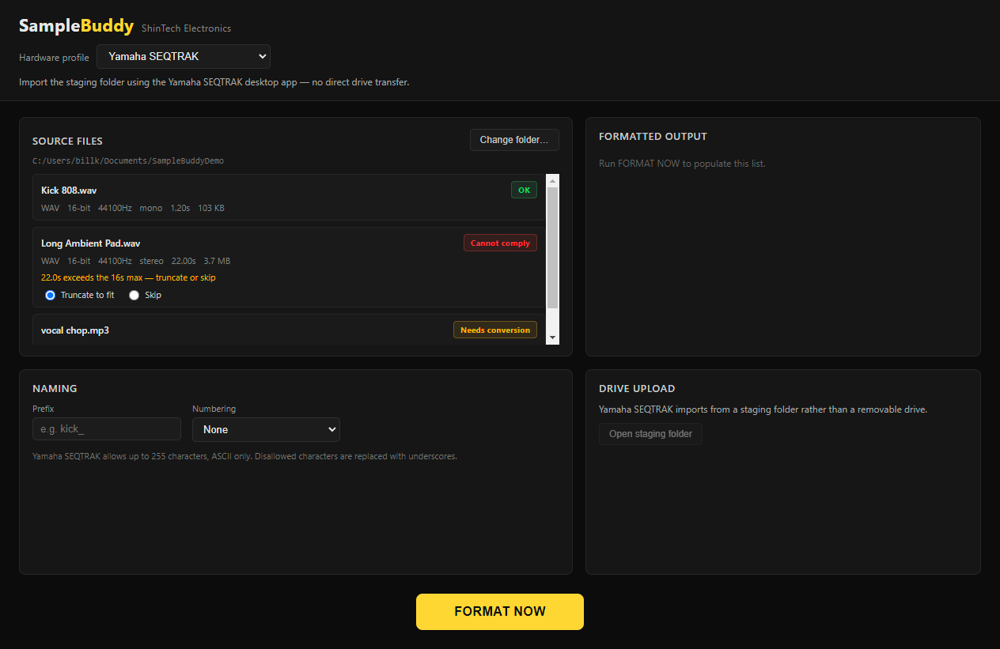
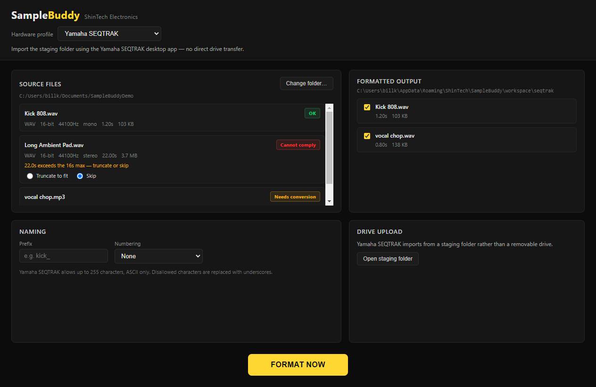
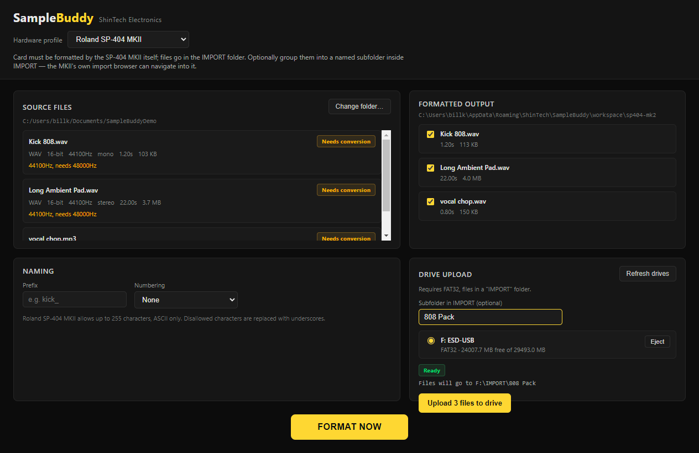
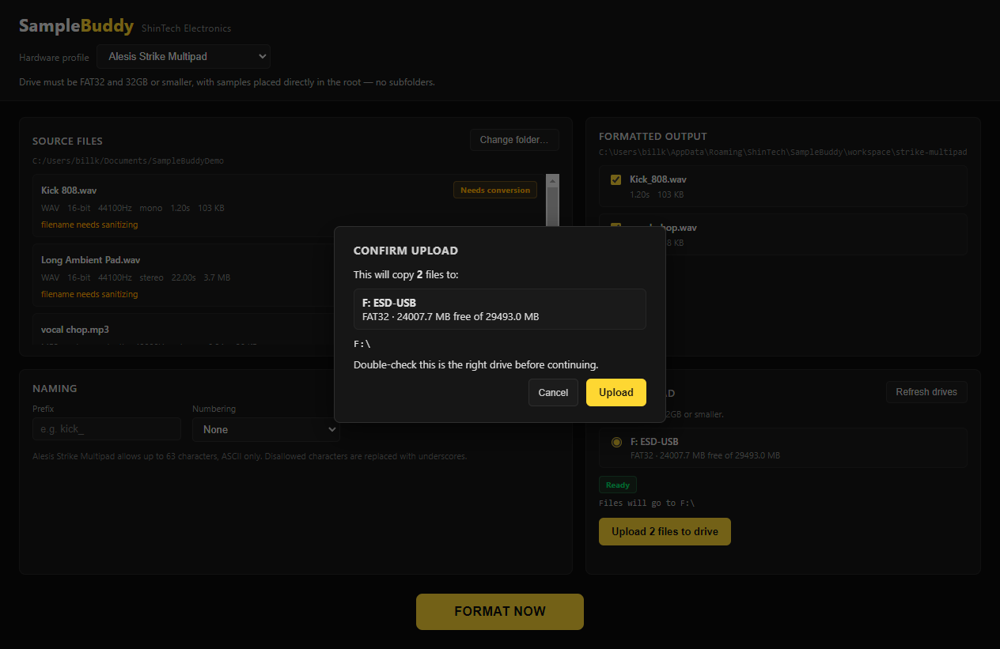

# SampleBuddy

*by ShinTech Electronics*

Every hardware sampler has opinions. This one wants 16-bit, that one wants 48kHz, this other one will silently choke on a filename with an apostrophe in it, and the one after that insists its SD card be formatted by the device itself or it sulks. Nobody has time to memorize all of that per device before every session.

SampleBuddy does. Point it at a folder of samples, tell it what hardware you're loading up, and it does the boring part: flags what's already good to go, converts what isn't, truncates or skips anything that's the wrong length, and sanitizes filenames so your sampler doesn't reject a kick drum sample on a technicality. Your original files never get touched — everything lands in its own tidy workspace, ready to go.

Think of it as a bouncer for your sample folder. It checks IDs at the door so your hardware doesn't have to.



## Supported hardware

| Device | Transfer method | Target format | Notes |
| --- | --- | --- | --- |
| Yamaha SEQTRAK | Staging folder | WAV, 16-bit, 44.1kHz | Import the staging folder with the Yamaha SEQTRAK desktop app — no direct drive transfer. |
| Alesis Strike Multipad | USB drive (FAT32, ≤32GB) | WAV, 16-bit, 44.1kHz | Files go directly in the drive root — no subfolders. |
| Roland SP-404 MKII | USB drive / SD card (FAT32) | WAV, 16-bit, 48kHz | Card must be formatted by the SP-404 MKII itself; files go in the `IMPORT` folder. |

More devices are on the way. If your sampler has a weird, specific rule about file naming, it will feel right at home here.

## How it works

1. **Pick your hardware.** The dropdown tells you its quirks so you don't have to remember them.
2. **Point it at a folder.** SampleBuddy scans everything and tells you, file by file, what's compliant and what isn't — and why. Anything too long gets an explicit truncate-or-skip choice, not a silent guess.
3. **Hit FORMAT NOW.** Anything that needs converting gets converted, and filenames get sanitized to match the device's rules.

   

4. **Send it to a drive.** For USB-drive devices, SampleBuddy detects connected removable drives, checks each one against the profile's requirements (filesystem, capacity, expected folder layout), and only lets you upload once it's actually compliant. Devices that support it (like the SP-404 MKII) can also group samples into a named subfolder inside the required import folder — the device's own import browser can navigate right into it.

   

5. **Confirm before it writes anything.** Uploading to the wrong USB stick is the kind of mistake you don't get to undo, so SampleBuddy always shows you exactly what's about to happen before it happens.

   

6. **Eject when you're done.** Every detected drive gets its own Eject button, using the same safe-eject Windows itself uses — it defers to Windows' own "device is busy" protection rather than force-closing anything, so it won't step on another program still reading from the drive.

For staging-folder devices like the SEQTRAK, there's no drive step — SampleBuddy just gives you a button to pop open the output folder so you can hand it to the manufacturer's own import app.

## Installation

Download `SampleBuddy-Setup-<version>.exe` from the [latest release](https://github.com/ShinobiFPV/SampleBuddy/releases/latest), run it, and follow the installer. No dependencies to install first — everything SampleBuddy needs (including FFmpeg) is bundled.

The installer isn't code-signed, so Windows SmartScreen will flag it on first run. Click **More info → Run anyway**.

Windows only, for now — your sampler probably doesn't care what OS made its WAV files, but Explorer-drive integration does.

## Dev commands

```
npm install
npm run dev       # launch in dev mode
npm run build     # production build
npm run pack      # unpacked electron-builder output
npm run release   # NSIS installer (unpublished, local build)
```

Tagged pushes (`vX.Y.Z`) trigger a [GitHub Actions workflow](.github/workflows/release.yml) that builds and publishes the installer to GitHub Releases automatically.
